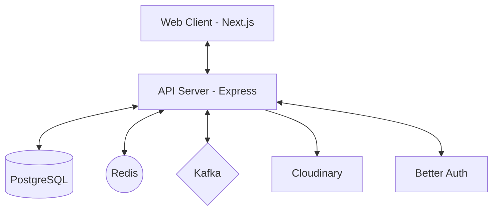

# Frequency Chat App

A modern, real-time chat application built with Next.js, Express, Socket.io, and Prisma.

## 🚀 Features

- **Real-time Messaging**: Instant message delivery using Socket.io.
- **Authentication**: Secure user authentication powered by Better Auth.
- **File Uploads**: Image and document sharing integrated with Cloudinary.
- **Group Chats**: Create and manage group conversations.
- **Modern UI**: Beautiful and responsive interface built with Tailwind CSS and Radix UI components.
- **Performance**: High-performance backend using Bun and Prisma with PostgreSQL.
- **Scalability**: Integrated with Redis and Kafka for advanced message handling and scalability.

## 🏗️ Architecture



## 🛠️ Tech Stack

### Frontend

- **Framework**: [Next.js 15+](https://nextjs.org/) (App Router)
- **State Management**: [Zustand](https://github.com/pmndrs/zustand)
- **Styling**: [Tailwind CSS](https://tailwindcss.com/)
- **Components**: [Radix UI](https://www.radix-ui.com/) / [Shadcn UI](https://ui.shadcn.com/)
- **Real-time**: [Socket.io Client](https://socket.io/docs/v4/client-api/)
- **Auth**: [Better Auth](https://better-auth.com/)

### Backend

- **Runtime**: [Bun](https://bun.sh/)
- **Framework**: [Express](https://expressjs.com/)
- **Database**: [PostgreSQL](https://www.postgresql.org/)
- **ORM**: [Prisma](https://www.prisma.io/)
- **Real-time**: [Socket.io](https://socket.io/)
- **Cache/PubSub**: [Redis](https://redis.io/)
- **Message Broker**: [Kafka](https://kafka.apache.org/)
- **Storage**: [Cloudinary](https://cloudinary.com/) (for media)

## 🏁 Getting Started

### Prerequisites

- [Bun](https://bun.sh/docs/installation) installed on your machine.
- [Docker](https://www.docker.com/) (recommended for running PostgreSQL, Redis, and Kafka).
- Cloudinary account for file uploads.

### Installation

1. **Clone the repository:**

   ```bash
   git clone https://github.com/lwshakib/frequency-chat-app.git
   cd frequency-chat-app
   ```

2. **Setup the Backend:**

   ```bash
   cd server
   bun install
   # Copy .env.example to .env and fill in your credentials
   cp .env.example .env
   # Run migrations
   bun run db:migrate
   # Start development server
   bun dev
   ```

3. **Setup the Frontend:**
   ```bash
   cd ../web
   bun install
   # Copy .env.example to .env and fill in your credentials
   cp .env.example .env
   # Start development server
   bun dev
   ```

## 📂 Project Structure

- `server/`: Express backend with Socket.io and Prisma.
- `web/`: Next.js frontend application.
- `docker-compose.yml`: Docker configuration for infrastructure (Postgres, Redis, Kafka).

## 🤝 Contributing

Contributions are welcome! Please see the [CONTRIBUTING.md](CONTRIBUTING.md) for guidelines.

## 📜 License

This project is licensed under the [MIT License](LICENSE).

## 👤 Author

Developed by [lwshakib](https://github.com/lwshakib).
