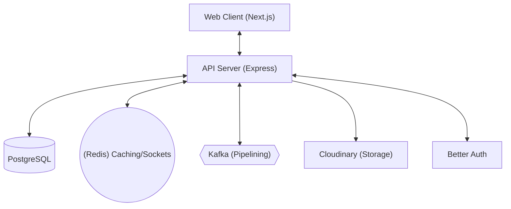

<p align="left">
  
</p>

# Frequency

A modern, real-time chat application built with Next.js, Express, Socket.io, and Prisma.

## 🚀 Features

- **Real-time Messaging**: Instant message delivery using Socket.io.
- **Notification Center**: Stay updated with in-app alerts for missed messages and calls, even when offline.
- **Authentication**: Secure user authentication powered by Better Auth with Google and Email support.
- **File Uploads**: Image and document sharing seamlessly integrated with Cloudinary.
- **Group Chats**: Create and manage vibrant group conversations with rich avatars.
- **Modern UI**: A premium, responsive interface featuring dynamic themes (Light/Dark) and smooth animations.
- **Enterprise Ready**: High-performance backend scaling with Redis and Kafka for advanced message pipelining.
- **Quality Assured**: Fully integrated unit and E2E testing using Jest, Playwright, and Bun Test.

## 🏗️ Architecture


```mermaid
graph TD
    Client["Web Client (Next.js)"] <--> Server["API Server (Express)"]
    Server <--> DB[("PostgreSQL")]
    Server <--> Redis(("(Redis) Caching/Sockets"))
    Server <--> Kafka{{"Kafka (Pipelining)"}}
    Server --> Cloudinary["Cloudinary (Storage)"]
    Server <--> BetterAuth["Better Auth"]
```

## 🛠️ Tech Stack

### Frontend
- **Framework**: [Next.js 15+](https://nextjs.org/) (App Router)
- **State Management**: [Zustand](https://github.com/pmndrs/zustand)
- **Styling**: [Tailwind CSS](https://tailwindcss.com/)
- **Components**: [Radix UI](https://www.radix-ui.com/) / [Shadcn UI](https://ui.shadcn.com/)
- **Real-time**: [Socket.io Client](https://socket.io/docs/v4/client-api/)
- **Auth**: [Better Auth](https://better-auth.com/)
- **Testing**: [Jest](https://jestjs.io/) & [React Testing Library](https://testing-library.com/docs/react-testing-library/intro/)

### Backend
- **Runtime**: [Bun](https://bun.sh/)
- **Framework**: [Express](https://expressjs.com/)
- **Database**: [PostgreSQL](https://www.postgresql.org/)
- **ORM**: [Prisma](https://www.prisma.io/)
- **Real-time**: [Socket.io](https://socket.io/)
- **Cache/PubSub**: [Redis](https://redis.io/)
- **Message Broker**: [Kafka](https://kafka.apache.org/)
- **Storage**: [Cloudinary](https://cloudinary.com/) (for media)
- **Email**: [Resend](https://resend.com/)
- **Testing**: [Bun Test](https://bun.sh/docs/cli/test) & [Supertest](https://github.com/ladjs/supertest)

## 🏁 Getting Started

### Prerequisites
- [Bun](https://bun.sh/docs/installation) installed on your machine.
- [Docker](https://www.docker.com/) for reliable infrastructure (Postgres, Redis, Kafka).
- Accounts for [Cloudinary](https://cloudinary.com/), [Resend](https://resend.com/), and [Google Cloud Console](https://console.cloud.google.com/).

### Installation

1. **Clone the repository:**
   ```bash
   git clone https://github.com/lwshakib/frequency-chat-app.git
   cd frequency-chat-app
   ```

2. **Setup Infrastructure (Docker):**
   ```bash
   docker-compose up -d
   ```

3. **Setup the Backend:**
   ```bash
   cd server
   bun install
   cp .env.example .env # Fill in your credentials
   bun run db:migrate
   bun dev
   ```

4. **Setup the Frontend:**
   ```bash
   cd ../web
   bun install
   cp .env.example .env # Fill in your credentials
   bun dev
   ```

## 🧪 Testing

### Server Tests
```bash
cd server
bun run test
```

### Web Tests (Unit & E2E)
```bash
cd web
bun run test        # Unit Tests
bun run test:e2e    # Playwright E2E Tests
```

## 🤝 Contributing
Contributions are welcome! Please check [CONTRIBUTING.md](CONTRIBUTING.md) for detail on our testing and code standards.

## 📜 License
This project is licensed under the MIT License.

## 👤 Author
Developed by [lwshakib](https://github.com/lwshakib).
