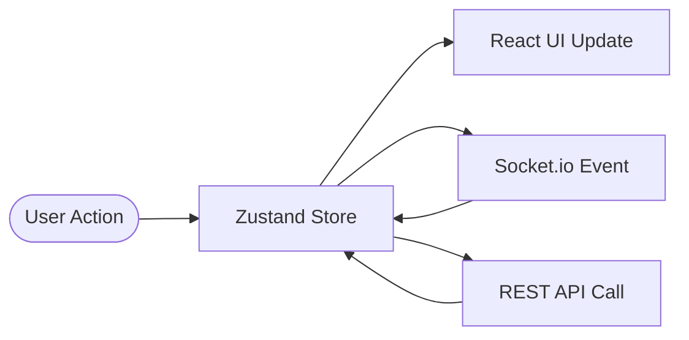

# Frequency Chat Web

The frontend for the Frequency Chat App, built with Next.js 15, Tailwind CSS, and Radix UI.

## 🚀 Features

- **Modern UI/UX**: Responsive and sleek design with Dark/Light mode support.
- **Real-time Updates**: Real-time messaging and notifications with Socket.io.
- **Dynamic Messaging**: Support for text, emojis, and file attachments.
- **Group Management**: Multi-user conversations with customizable metadata.
- **Secure Auth**: Seamless login and signup powered by Better Auth.
- **State Management**: Efficient client-side state with Zustand.
- **Form Handling**: Robust form validation using React Hook Form and Zod.

## 🔄 Data Flow



## 🛠️ Technologies

- **Framework**: Next.js 15 (App Router)
- **Styling**: Tailwind CSS
- **Components**: Radix UI / Shadcn UI
- **Animations**: Framer Motion
- **State**: Zustand
- **Real-time**: Socket.io Client
- **Auth**: Better Auth React Client
- **Icons**: Lucide React & Tabler Icons

## 🏁 Getting Started

### Prerequisites

- [Bun](https://bun.sh/) or [Node.js](https://nodejs.org/)

### Installation

1. **Install dependencies:**

   ```bash
   bun install
   ```

2. **Environment Variables:**
   Create a `.env.local` file in the root of the `web/` directory and add the following:

   ```env
   NEXT_PUBLIC_SERVER_URL=http://localhost:4000
   ```

3. **Run Development Server:**
   ```bash
   bun dev
   ```

## 📜 Scripts

- `bun dev`: Start development server.
- `bun run build`: Build for production.
- `bun start`: Start production server.
- `bun run lint`: Run ESLint.

## 📂 Structure

- `app/`: Next.js App Router pages and layouts.
- `components/`: Reusable UI components.
- `hooks/`: Custom React hooks.
- `lib/`: Utility functions, API services, and auth configuration.
- `context/`: React Context providers.
- `types/`: TypeScript type definitions.
- `public/`: Static assets.

## 🎨 UI & Design

The application follows a premium design aesthetic using:

- **Shadcn UI** for core components.
- **Tailwind CSS** for custom styling.
- **Next Themes** for theme switching.
