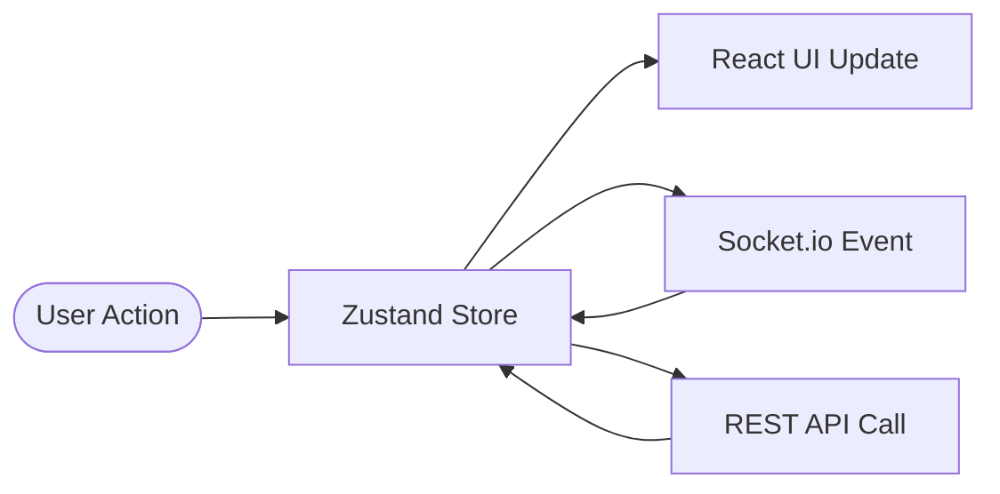

# Frequency Chat Web

The stunning frontend for the Frequency Chat App, built with Next.js 15, Tailwind CSS, and Radix UI.

## 🚀 Features

- **Modern UI/UX**: Premium, responsive, and sleek design with dynamic Dark/Light mode support.
- **In-App Notification Center**: Real-time alerts for missed messages and calls with persistence across sessions.
- **Real-time Updates**: Real-time messaging and notifications powered by Socket.io.
- **Dynamic Messaging**: Support for text, emojis, and file attachments integrated with Cloudinary.
- **Group Management**: Multi-user conversations with customizable metadata and rich avatars.
- **Secure Auth**: Seamless login and signup powered by Better Auth.
- **Comprehensive Testing**: Unit testing with Jest and E2E validation with Playwright.
- **State Management**: Efficient client-side state with Zustand.
- **Animations**: Fluid experience using Framer Motion.

## 🔄 Data Flow


```mermaid
graph LR
    User([User Action]) --> Store[Zustand Store]
    Store --> UI[React UI Update]
    Store --> Socket[Socket.io Event]
    Store --> API[REST API Call]
    Socket --> Store
    API --> Store
```

## 🛠️ Technologies

- **Framework**: Next.js 15 (App Router)
- **Styling**: Tailwind CSS / Shadcn UI
- **Animations**: Framer Motion
- **State**: Zustand
- **Real-time**: Socket.io Client
- **Auth**: Better Auth React
- **Testing**: Jest & Playwright

## 🏁 Getting Started

### Prerequisites
- [Bun](https://bun.sh/) or [Node.js](https://nodejs.org/)

### Installation

1. **Install dependencies:**
   ```bash
   bun install
   ```

2. **Environment Variables:**
   Create a `.env` file based on `.env.example`:
   ```bash
   cp .env.example .env
   ```

3. **Run Development Server:**
   ```bash
   bun dev
   ```

## 🧪 Testing
```bash
bun run test        # Unit Tests (Jest)
bun run test:e2e    # E2E Tests (Playwright)
```

## 📜 Scripts

- `bun dev`: Start development server.
- `bun run build`: Build for production.
- `bun run lint`: Run ESLint.
- `bun run format`: Format code with Prettier.
- `bun run test`: Run unit tests.
- `bun run test:e2e`: Run Playwright E2E tests.

## 📂 Structure

- `app/`: Next.js App Router pages and layouts.
- `__tests__/`: Unit and E2E test suites.
- `components/`: Reusable UI components.
- `context/`: React Context and Zustand stores.
- `lib/`: Utility functions, API services, and auth configuration.
- `types/`: TypeScript type definitions.
- `public/`: Static assets (Logo, Favicons).
